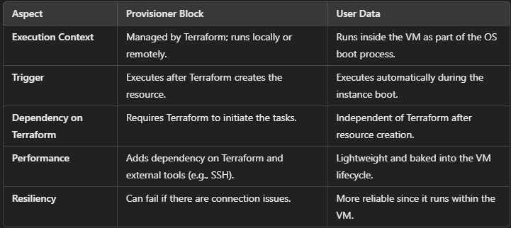

## Blocks in Terraform ##
**1. Terraform Block** 
   - it is used to define global configure
   - setting specific version
   - configuring backend for storing the state file
   - defining experimental or optional feature

````
terraform{ 
    required_providers{ ### indicates the providers used in your configuration
        aws{
            source = "hashicrop/aws ## specifies provider namespace
            version = ">= 2.7.0" ## specifies  provider version
        }
    }
}

````
**2. Provider Block**
  - used to configure and define the provider for specific cloud or information.
  - In provider block we specify details such as provider name and version
  - their are two ways to define the provider block

  i. direct adding the access and sceret key in provider block

  ````
  provider "aws" {
  region = "us-west-2"
  access_key = " access-key"
  sceret_key = " sceret-key"
}

````

ii. adding the keys inside the profile with aws configure --profile profile_name. for security in terminal

````
provider "aws" {
  region = "us-west-2"
  profile = "profile_name"
}

````
**3. Resource Block**

     - The resource block is used to define the infrastructure components (like EC2 instances, storage, etc.) that you want to create and manage.

````
resource "aws_instance" "example" { ## example is the  logical name or identifier using inside the terraform
  ami           = "ami-0c55b159cbfafe1f0"
  instance_type = "t2.micro"
}

````
**4. Variable Block**

    - The variable block is used to define input variables for your Terraform configuration, allowing for parameterization and reuse.
-- insted of hardcoding values you can define variables.
````
variable "instance_type" {
  description = "Type of EC2 instance"
  type= string
  default = "t2.micro"
}
````
**5. Output Blocks**
    - The output block defines the values that Terraform will display to the user after applying the configuration, useful for debugging or passing data.
````
output "instance_id" {
  value = aws_instance.example.id
}
````

**6. Module Block**
     - The module block allows you to organize and reuse Terraform configurations by calling modules, which can be locally or from the Terraform Registry.
````
module "vpc" {
  source = "terraform-aws-modules/vpc/aws"
  name   = "my-vpc"
  cidr   = "10.0.0.0/16"
}
````

**7. Data Block**
    - The data block is used to retrieve data from a provider that is read-only, such as fetching an existing resource's state (e.g., retrieving an existing AMI).
````
data "aws_ami" "latest_amazon_linux" {
  most_recent = true
  owners      = ["amazon"]
  filters = {
    name = "amzn2-ami-hvm-*-x86_64-gp2"
  }
}
````
**8. Local Block**
     - The locals block allows you to define local values in your Terraform configuration that can be used within the configuration for expressions or to simplify repeated log.
````
locals {
  instance_name = "example-instance"
}
````

**9. Backend Block**
     - The backend block in Terraform is used within the terraform block to configure where and how Terraform stores its state file.
````
terraform {
backend "s3" {
bucket = "mybucket" ## name of bucket created 
key = "path/to/my/key" ### name of file and the path where u want to create within s3 bucket
region = "us-east-1"
}
}
````
**10. Provisioner Block**
      - The provisioner block in Terraform is a way to run tasks or scripts after a resource is created or updated.
      - It’s like giving Terraform extra instructions to set things up, such as installing software, copying files, or running commands 
        to configure the resource.
````
resource "aws_instance" "example" {
  ami           = "ami-123456"
  instance_type = "t2.micro"

  provisioner "remote-exec" {
    inline = [
      "sudo apt-get update",
      "sudo apt-get install -y nginx",
    ]
  }
}
````
## Key Types of Provisioner ##
1. Local Exec:  Executes a command locally on the machine running Terraform.
````
resource "aws_instance" "example" {
  ami           = "ami-123456"
  instance_type = "t2.micro"

  provisioner "local-exec" {
    command = "echo ${self.id} > instance_id.txt"
  }
}
````

2. Remote Exec : Executes a command remotely on the resource via SSH or WinRM
````
resource "aws_instance" "example" {
  ami           = "ami-123456"
  instance_type = "t2.micro"

  connection {
    type        = "ssh"
    user        = "ubuntu"
    private_key = file("~/.ssh/id_rsa")
    host        = self.public_ip
  }

  provisioner "remote-exec" {
    inline = [
      "sudo apt-get update",
      "sudo apt-get install -y nginx",
    ]
  }
}
````
3. File : The file provisioner in Terraform is used to copy files or directories from the machine running Terraform to the target resource. This is particularly useful for uploading configuration files, scripts, or other assets that the resource needs.
````
provisioner "file" {
  source      = "path/to/local/file_or_directory"
  destination = "/path/to/remote/location"
}
````



